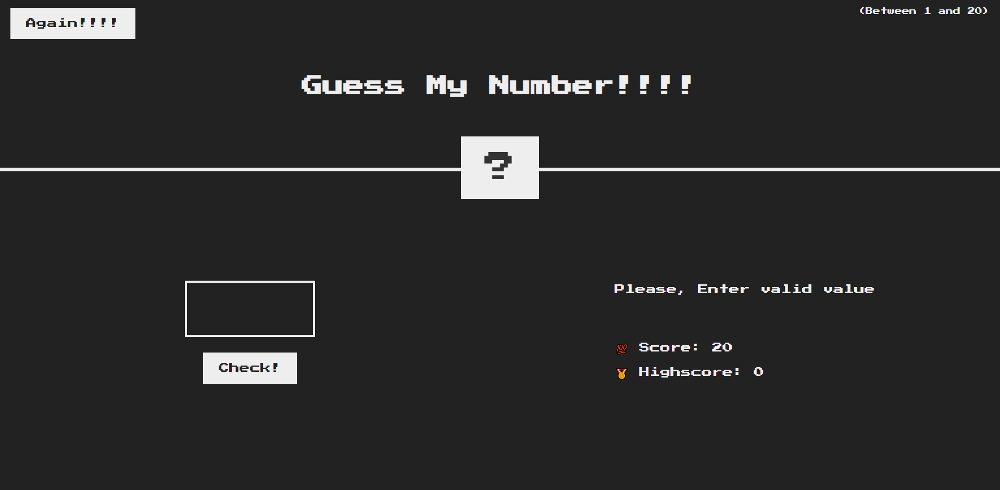
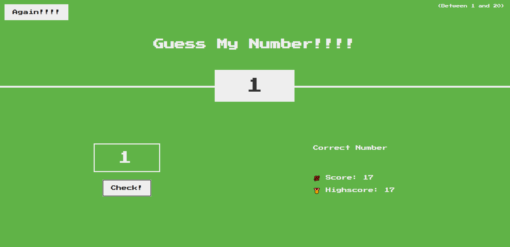

Guess My Number 🎯

A simple browser-based number guessing game built using vanilla JavaScript. The player must guess a randomly generated number between 1 and 20, with real-time feedback, score tracking, and a high-score system.

## 🔗 Live Demo
👉 https://sagar-aherrao.github.io/Guess-my-number/

📌 Project Overview

Guess My Number is a beginner-friendly JavaScript project that demonstrates:

DOM manipulation
Event handling
Conditional logic
Random number generation
Game state management

The game starts with a score of 20, which decreases with each incorrect guess.

🎮 How the Game Works

The game generates a secret number between 1 and 20.
The player enters a number and clicks Check!.
Feedback is displayed:

Too High
Too Low
Correct Number

Each wrong guess reduces the score by 1.

On a correct guess:

Background color turns green
The secret number is revealed
High score updates if the current score is higher
Clicking Again!!!! resets the game while preserving the high score.

⚙️ Features

Random number generation using JavaScript
User input validation
Score system starting at 20
High score tracking (session-based)
Reset / play-again functionality
Visual feedback on winning

🛠️ Technologies Used

HTML5
CSS3
JavaScript (ES6)

📂 Project Structure
Guess-my-number/
│
├── index.html
├── style.css
├── script.js
└── README.md

🧠 JavaScript Logic Summary

Uses Math.trunc(Math.random() * 20) + 1 to generate the secret number
Event listeners handle:
Guess checking
Game reset

DOM manipulation updates:
Messages
Score
Background color
Number display

High score updates dynamically during gameplay

🖼️ Screenshots

### Game Start

### Correct Guess

🚀 How to Run the Project

Clone the repository:
git clone https://github.com/sagar-aherrao/Guess-my-number.git

Navigate to the project folder:
cd Guess-my-number

Open index.html in your browser
(or use Live Server for best experience)

📈 Future Improvements

Save high score using localStorage
Add difficulty levels
Improve UI/UX design
Add keyboard support (Enter key)

📄 License
This project is open-source and available under the MIT License.
